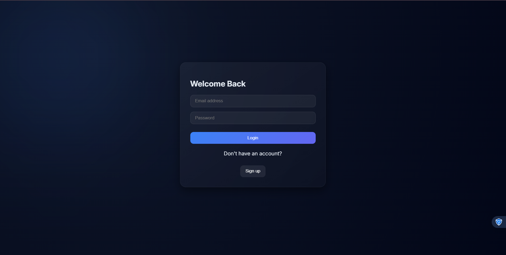
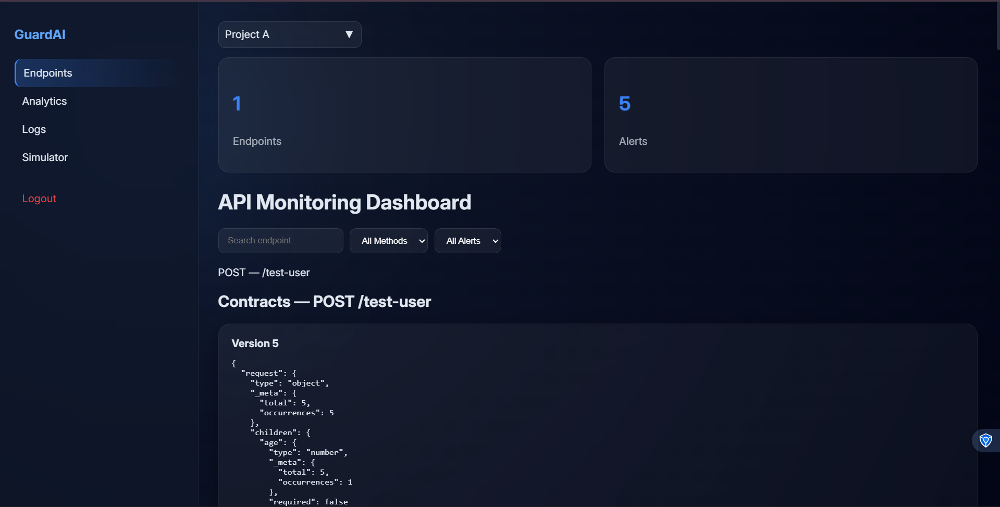
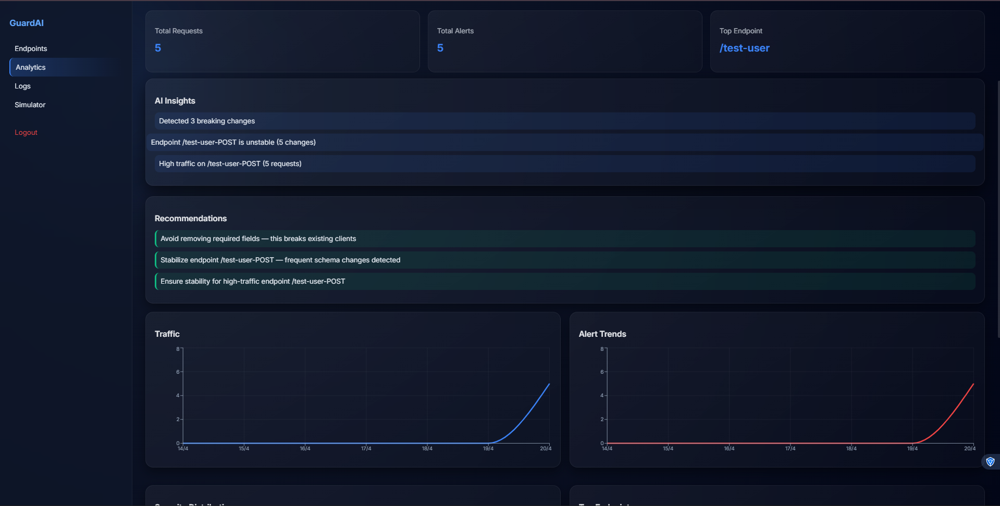
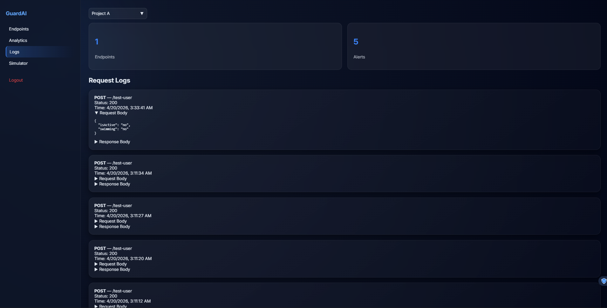

# GuardAI — API Breaking Change Detection & Monitoring Platform

---

## Introduction

Modern applications depend heavily on APIs. Even small changes in request/response structures can silently break clients, leading to production issues that are hard to detect.

GuardAI is a full-stack platform designed to monitor API behavior in real-time, detect breaking changes automatically, and provide actionable insights through a modern dashboard.

---

## Problem Statement

Developers face several challenges when working with evolving APIs:

- No visibility into real-world API usage
- Breaking changes go unnoticed until clients fail
- Difficult to track schema evolution over time
- Lack of tools to measure impact of API changes
- Manual debugging of API issues is slow and inefficient

---

## Solution

GuardAI solves these problems by:

- Capturing live API traffic (requests & responses)
- Automatically generating and versioning API schemas
- Detecting breaking changes between versions
- Storing structured logs for analysis
- Providing a visual dashboard with insights and alerts

---

## Key Features

### API Traffic Monitoring
- Capture request & response payloads
- Store logs in database
- Track endpoint usage

### Schema Tracking
- Automatic schema extraction
- Versioned API contracts
- Schema comparison across requests

### Breaking Change Detection
- Detect:
  - Removed fields
  - Type changes
  - New fields
- Classify severity:
  - BREAKING
  - SAFE

### Analytics Dashboard
- Traffic trends
- Alert trends
- Severity distribution
- Top endpoints
- Field usage insights

### AI Insights & Recommendations
- Detect unstable endpoints
- Highlight risky patterns
- Suggest improvements

### API Simulator
- Test endpoints directly
- Trigger schema changes intentionally

### Background Processing
- Queue-based processing using Redis + BullMQ
- Async schema comparison

---

## Architecture

```
Client App → GuardAI Middleware → Supabase (Logs)
                                → Redis Queue
                                      ↓
                                Worker (Schema Processing)
                                      ↓
                         Contracts + Alerts + Analytics
                                      ↓
                              React Dashboard
```

---

## Project Structure

```
.
├── backend/              # API server (auth + analytics + endpoints)
├── dashboard/            # React frontend (UI)
├── guardai-monitor/      # NPM package (monitoring + worker)
├── test-app/             # Local testing app
├── assets/                 # Screenshots
├── package.json
└── README.md
```

---

## Application Screenshots

| Login Page | Dashboard Page |
|----------------|-------------------|
|  |  |

| Analytics Page | Logs Page |
|------------------|-------------------|
|  |  |
---

## Tech Stack

### Backend
- Node.js
- Express
- Supabase (PostgreSQL)
- BullMQ + Redis

### Frontend
- React
- Axios
- Recharts

### Infrastructure
- Redis (queue processing)
- Supabase (database)

---

## Getting Started

### Clone Repository

```bash
git clone https://github.com/Rachit753/ai-api-breaking-change-detector.git
cd ai-api-breaking-change-detector
```

---

### Setup Backend

```bash
cd backend
npm install
npm run dev
```

Create `.env`:

```env
SUPABASE_URL=your_url
SUPABASE_KEY=your_key
JWT_SECRET=your_secret
```

---

### Setup Dashboard

```bash
cd dashboard
npm install
npm start
```

Create `.env`:

```env
REACT_APP_API_URL=http://localhost:5000/api
```

---

### Start Redis

```bash
redis-server
```

---

### Start Worker

```bash
cd guardai-monitor

# PowerShell
$env:SUPABASE_URL="your_url"
$env:SUPABASE_KEY="your_key"

node runWorker.js
```

---

### Run Test App (Optional)

```bash
cd test-app
npm install
node index.js
```

---

## How It Works

1. Middleware captures API traffic  
2. Logs stored in Supabase  
3. Job pushed to Redis queue  
4. Worker processes:
   - Extract schema
   - Compare with previous version
   - Detect changes  
5. Contracts & alerts stored  
6. Dashboard visualizes data  

---

## Example Scenario

If a field is removed from API response:

```
REMOVED_FIELD → BREAKING
```

GuardAI will:
- Detect the change
- Store a new contract version
- Generate an alert
- Show impact on dashboard

---

## Current Limitations

- Redis is required (no fallback yet)
- Basic rate limiting handling
- Limited multi-tenant support

---

## Future Improvements

- Real-time updates (WebSockets)
- Advanced alert deduplication
- CI/CD integration
- OpenAPI export
- Team collaboration features

---

## NPM Package

Core monitoring system is available separately:

```
guardai-monitor/
```

---

## Author

Rachit Chauhan

---

## Why GuardAI?

Most tools monitor uptime.

GuardAI monitors **API correctness**.

That’s the difference between:
- "Server is up"   
- "API won’t break your frontend" 